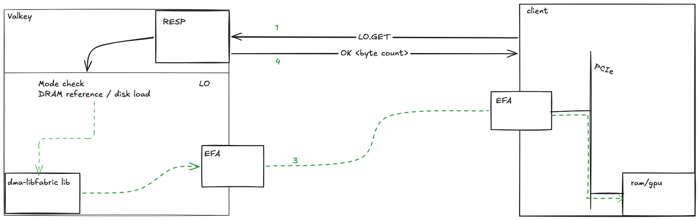

# ValkeyLargeObject RDMA Communication Safety
ValkeyLargeObject is a Valkey module being co-developed by AWS Elasticache
and Momento to store large objects on disk, and transfer them efficiently
over RDMA (remote direct memory access) via AWS EFA (elastic fabric adapter).

This is a communication channel intended for single-tenant clients and
single-tenant servers.

## How it works

The RDMA communication path `[3]` is slaved to
the RESP "control" channel `[1,4]`. EFA sits idle until an LO.SET or LO.GET
command arrives over RESP, and then it transfers data according to the rules
specified in the command.

A couple DMA invariants that wall off some broad vulnerabilities:

1. The server never registers `RemoteAccessible` memory.
2. The server is the initiator of all DMA operations.

Invariant 2 is a consequence of 1: You can't actually express a valid RDMA
operation without 1. Since the server deprives the client of any remote accessible
memory, no client can initiate an RDMA operation.

We consider attack vectors that require RCE to be out of scope, since given RCE
anything is possible.

## Vulnerability: RESP channel
TLS support, public key verification, and RESP auth provide the Valkey transport
security story according to end user needs. None of these are added or removed by
ValkeyLargeObject. They are used as a secure control channel for RDMA commands.

`[1,4]` in the diagram are considered to be securable.

## Vulnerability: RDMA channel
Contrasting with RESP, the RDMA channel uses plaintext networking to interact with
the valkey server and clients.

EFA hardware interface implementation is provided by `libfabric`, which is a
system library present on AWS hosts that have EFA hardware.

Let's list out some possibilities, in the form of claims.

### RDMA is insecure
Invariant 2 guards the server's integrity. Clients have some protections that are built
in to nitro. `rkey`s are generated by AWS nitro firmware, and the details of that are not
public information. If we trust that it's unpredictable, then clients have pretty good
protection against well-intentioned mistakes on localhost. If it's predictable, then we're
more reliant on the client's server address registry, plus the RESP channel's TLS-capable
safety in transit.

`rkey`s do not carry much entropy even in the best case, being 32 bits. Notably, you are
_heavily_ incentivized to reuse `rkey`s for a long time, because memory registration (which
would mint a new `rkey`) is costly. Nevertheless, nitro firmware does require that targets
hold initiator addresses in their address vectors. That is, clients individually whitelist
servers they are willing to receive RDMA from.

By delivering the whitelist over the RESP channel via `LO.HELLO`, the client's address
vector is (as) trustworthy (as the RESP channel).

* `rkey` is more of a correctness and memory integrity check than a security mechanism.
* Bytes travel in plaintext (ostensibly) over AWS fabric, which is assumed to be physically
  secure.
* Allowed initiators (ValkeyLargeObject server EFA addresses) are delivered over RESP, and
  are the primary means of preventing unauthorized access.
* The client essentially grants complete trust to the server for the memory regions it
  registers.

RDMA is less secure than RESP. The transfer mechanism is not public, and is not reviewed with
full transparency. The transmission of data is, pessimistically, able to be observed by an
attacker with physical access, or administrative access to nitro or fabric interconnects, if
such access and interconnects exist.

Additionally, I've not been able to find a specification that guarantees that targets must
register originator addresses. It is observed to be a requirement, and it appears in kernel
source. Ultimately though it isn't proven that this is and must always be the semantic.
* https://github.com/torvalds/linux/blob/08df884136f1c1197bab2a27814404fd329d9aac/drivers/infiniband/hw/efa/efa_io_defs.h#L64-L65
* https://github.com/ofiwg/libfabric/blob/b54af372f70773b1213f486892b1302855412264/prov/efa/src/efa_errno.h#L73
* https://github.com/ofiwg/libfabric/blob/b54af372f70773b1213f486892b1302855412264/prov/efa/src/efa_errno.h#L174-L176

The libfabric error strings are relayed back across the RESP channel, so users can debug
client integrations and understand how to correct their software.

RESP is still the right choice for transmitting data with extreme value or consequence for
disclosure. RDMA is a valid option for users transmitting data that tolerates the additional
trust: Where RESP only requires you to trust EC2 (and PKI), RDMA requires you to trust EC2,
AWS networking, and AWS datacenter security.

Further reading: https://www.usenix.org/system/files/sec21-rothenberger.pdf

Subject to this section's caveats, let's continue to other claims.

### Clients can read arbitrary server memory (no)
Flags are combined like  `Read | Write | RemoteAccessible` to determine the kind
of interaction a piece of memory may be allowed to participate in. Server memory
is _never registered_ with `RemoteAccessible` flag set (invariant 1).

EFA hardware requires that memory is pre-registered, and the registration
includes access semantics. The initiator of an RDMA, that is, the caller of the
`libfabric` `fi_read` (same for write path, different flags), provides 3 things
broadly:
1. Local memory
2. Remote memory address registered with `Read | RemoteAccessible`
3. `rkey`

***Given*** a client attacker with knowledge of server memory addresses they want to
read, they cannot satisfy `rkey`, and they can't reference the memory anyway per (invariant 1).

***Given*** a client attacker with [1] knowledge of server memory addresses _and_ [2]
an rkey they got via a zero-day or via exploiting a server vulnerability, they still
cannot read that data because it does not have the `RemoteAccessible` bit set. (invariant 1)

***Given*** a client attacker with [1] knowledge of server memory, [2] a forged or
exploited rkey, and [3] the ability to induce server behavior changes that it does not
have code to actually do, that is, a client with remote code execution on the server,
it is theoretically possible to load arbitrary data from the server.

### Clients can misdirect DMA into another server's EFA (sort of)
In addition to registering its memory as remote accessible, a client must register the
address(es) that are allowed to refer to memory a client registered. If two clients are
using different Valkey servers and client A is malicious and wants to put bogus data into
client B, A would have to convince B to register memory space that is allowed to receive
from A's valkey server.

There are conceivable reasons to want to do this legitimately. Consider an llm KV cache
orchestrator. You might choose to run an orchestrator with a view of all your inference
hardware, and submit ValkeyLargeObject `LO.GET`s into remote GPUs that you registered
in your orchestrator. That's legitimate rather than an attack. But given all the
coordination of registering gpu memory, registering ValkeyLargeObject EFA addresses,
generating `rkey`s, and communicating them to the orchestrator, one could imagine an
attacker doing the same. It would require RCE on the remote/victim.

There is an optional crc32c that can be delivered over RESP for both the GET and SET paths.
This is another layer of integrity / error detection like rkey, but for data races.

### Clients can RCE on the server (no)
ValkeyLargeObject registers memory used as data buffers. These data buffers, as with
ValkeyString (get/set data type) are not interpreted. One can upload bytecode or anything
else, and it's just a data value.

Clients can neither name server memory, nor choose where something is read from or written
to. They can only advertise their own buffers and allow whitelisted server EFAs to interact
with the local memory they explicitly whitelist.

All transfers are length-limited and length-checked. A partial transfer is aborted, and the
memory is treated as garbage. There is no interpretation or execution of data buffers.

### Clients can degrade servers with $behavior (probably)
It is possible to saturate EFA's, just as it's possible to saturate normal networking.
The effect is similar, but normal RESP commands should not be sorely afflicted.

Registering and deregistering connections rapidly, artificially constraining your EFA to
bytes per second (slowloris style), and submitting way more requests than you have throughput
to handle can all possibly have some system impact. This will be an area of iteration;
particularly because the way this affects Valkey and other clients may be different per
libfabric provider (only efa-direct is targeted currently).

It is understood that this module is intended for single-tenant use, so well-formed malicious
use is not expected to be common. It's worth noting that RESP has mirroring concerns around
well-formed malicious use as well that are neither solved nor intensified by ValkeyLargeObject.

### Attackers can MITM RDMA operations (no)
ValkeyLargeObject EFA addresses are discovered via RESP, which is secured separately (e.g.,
via tls).

To spoof as a valkey server, one must defeat TLS or other server identity protections the
server uses.

Since the addresses came from a server who was verified via PKI (public key infrastructure)
or some other means, and _only_ those addresses are registered as being allowed to interact
with this client, no other server can interact with client memory registrations made for the
ValkeyLargeObject server(s).

Short of causing libfabric to return a malicious address list (an RCE on the server), the
address list delivered to the client is secure.

### Attackers can read RDMA data in flight (theoretically)
It is believed that this is possible, but not without physical access to AWS datacenters.

`efa-direct` only works within an availability zone, and ostensibly the links are not left
unprotected. AWS customers do not have access to fabric relays, if such devices exist, which
leaves an attacker few methods other than RCE on a victim client host, RCE on a
ValkeyLargeObject server, or physical access to the interconnects.

### Attackers can replay RDMA operations (no)
If an attacker can read AWS fabric in situ, they can read the data. They cannot, however,
initiate an RDMA operation against either clients or servers, so they cannot replay a request.
They also cannot spoof as Elasticache assuming PKI integrity, so they cannot replay the data
to the client. Only with RCE on the server with access to the registered domains the client
has allowed can an attacker transfer malicious data.

### An ec2 customer can pollute the memory of another customer (unlikely)
`libfabric` memory registrations map virtual memory to physical pages. You have to give it
allocated memory, which is then locked for the duration of its availability to `libfabric`.
If two users can `malloc` and get the same physical addresses, then yes a customer can
pollute another customer's ec2 memory, but shared physical memory and malloc safety is an
ec2 concern that is not addressable by an ec2 client or ValkeyLargeObject.

It is unknown whether a pci-e side-channel attack is possible via AWS nitro. Factors like
instance placement and tenancy varying with attached EFA's would have to be considered.
These kinds of attacks are similar in spirit to spectre or meltdown, but are the domain of
nitro hardware and firmware designers to stamp out, should they prove possible.
